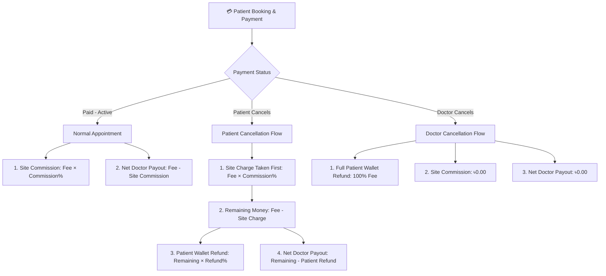

# 🏥 CareBridge AI — Smart Clinical Telemedicine & AI Health Assistant Platform

[](https://www.python.org/)
[](https://www.djangoproject.com/)
[](https://ai.google.dev/)
[]()

CareBridge AI is an enterprise-grade, full-stack clinical telemedicine, prescription translation, dose tracking, and financial analytics platform built with **Django 4.2+**, **Google Gemini AI**, **ReportLab PDF**, and **Tailwind CSS**.

---

## 📐 System Architecture & Single Source of Truth

CareBridge AI utilizes a centralized `SiteSettings` configuration engine (`accounts/models.py`) to govern all platform financial calculations, site rules, UI badges, notification messages, and PDF statements dynamically.

```mermaid
flowchart TD
    SS[⚙️ SiteSettings Model] -->|platform_commission_rate| Calc[Financial Engine]
    SS -->|patient_refund_percentage| Calc
    
    Calc -->|Auto-Compute| AptSave[Appointment.save]
    Calc -->|Dynamic Context| ContextProc[ui_settings Context Processor]
    Calc -->|Template Tags| Helpers[ & ]
    
    ContextProc -->|Global Variables| UI[Patient, Doctor & Admin Templates]
    Calc -->|Dynamic Messages| Notif[AppNotification System]
```

### 🔹 Single-Source-of-Truth Variables:
- `platform_commission_rate`: Configurable platform site charge percentage (Default: `15.00%`).
- `patient_refund_percentage`: Configurable partial refund percentage on patient-initiated cancellations (Default: `35.00%`).

*Changing any rate in `SiteSettings` automatically propagates across all financial math, notification texts, user templates, and PDF reports instantly without code modification.*

---

## 🔄 Financial & Cancellation Flow Diagram

CareBridge AI enforces strict, audit-compliant financial accounting for all transactions:



---

## 🌟 Comprehensive Feature Matrix

### 👤 1. Patient Portal
- **2-Column Responsive Command Center**: Displays personal `#PAT-ID`, vitals, daily medication checklist, upcoming follow-ups, and interactive schedule calendar.
- **Daily Dose Tracker & Custom Schedule Manager**: Real-time medication adherence tracking with dose time slots (*Morning, Afternoon, Evening, Night*) and adherence percentages (`0-100%`).
- **Follow-Up Deadline Management**: Enforces scheduled follow-up dates and booking deadline validations.
- **CareBridge AI Virtual Health Assistant**: Multilingual (English & Bangla) voice-enabled AI assistant for prescription translation, dosage explanations, and symptom checks powered by Google Gemini AI.
- **ReportLab PDF Exporters**:
  - `Overall Medical Summary Report` (Vitals, Diagnoses, Medical History, Active Prescriptions).
  - `Dose Track Report` (Medication schedules, adherence logs, taken/skipped logs).
  - `Payment Statement Report` (Receipts, platform fees, wallet refund transactions).

### 👨‍⚕️ 2. Doctor Portal
- **2-Column Responsive Dashboard**: Features Doctor ID (`#DOC-ID`), BMDC Verification seal, consultation fee, weekly schedule management, and quick action controls.
- **Digital Prescription Builder**: Clinical workflow supporting visit vitals (*Heart Rate, BP, SpO2, Temp, Weight, Height*), chief complaints, diagnosis, lab tests, medications, advice rules, and follow-ups.
- **Virtual Digital Signature Box & Seal**: Every generated prescription PDF includes an official medical header, timestamped verification hash (`#CARE-RX-[id]-[timestamp]`), and an embedded **Virtual Digital Signature Card**:
  ```
  +---------------------------------------------------------+
  | Dr. [Doctor Full Name]                                  |
  | Virtual Digital Signature                               |
  | [ ✓ DIGITALLY SIGNED & VERIFIED ]                       |
  | BMDC Reg No: #A-XXXXX                                   |
  | Signed Date: 03 Sep 2026, 02:30 PM                      |
  +---------------------------------------------------------+
  ```
- **Chamber Schedule & Slot Manager**: Configure weekly time slots, consultation fees, and appointment durations.
- **Patient Adherence Directory**: View patient histories, adherence percentages (`0-100%`), and past prescriptions.

### 🛡️ 3. Admin Analytics & System Management
- **Role-Based Access Control (RBAC)**: Custom `RoleBasedAccessMiddleware` ensuring strict path enforcement across Patient (`/patient/`), Doctor (`/doctors/`), and Admin (`/reports/admin/`) portals.
- **Doctor Performance & Financial Analytics**: Real-time breakdown of:
  - **Total Site Income (BDT)**: Total site commission collected across paid appointments and patient cancellations.
  - **Monthly & Weekly Site Income**: Rolling calendar trend analytics.
  - **Total Patient Refunds (BDT)**: Audited patient wallet refund log.
- **Doctor Quick Search & Dropdown Control**: Quick search input (`#docSearchInput`) integrated alongside the doctor selection dropdown.
- **Doctor Account Management & Safe Deletion**: Admin capability to track performance, export statements, or delete doctor profiles safely with modal protection.
- **System Announcement Management**: Published news management table with **Edit & Delete CRUD controls** for updating announcements dynamically.

---

## 🛠️ Technology Stack

| Component | Technology / Library |
| :--- | :--- |
| **Backend Framework** | Python 3.13, Django 4.2+ |
| **Database** | SQLite (Default) / PostgreSQL Ready |
| **PDF Generation Engine** | ReportLab (with TTF Unicode Font Registration) |
| **AI Integration** | Google Gemini AI (`google-generativeai`) |
| **Frontend Styling** | Tailwind CSS, Custom CSS Design System |
| **Icons & Visuals** | FontAwesome 6 Pro, Custom Clinical Avatars |
| **Middleware** | RoleBasedAccessMiddleware, NoCacheAuthenticationMiddleware |

---

## 🚀 Installation & Local Development Setup

### 1. Prerequisites
- Python 3.10+
- Git

### 2. Clone Repository & Setup Virtual Environment
```bash
git clone https://github.com/udoydev/CareBride_AI.git
cd "Carebridge AI"

# Create virtual environment
python -m venv venv

# Activate virtual environment
# Windows:
venv\Scripts\activate
# Mac/Linux:
source venv/bin/activate
```

### 3. Install Dependencies
```bash
pip install -r requirements.txt
```

### 4. Configure Environment Variables (`.env`)
Create a `.env` file in the project root:
```env
DEBUG=True
SECRET_KEY=your-django-secret-key
GEMINI_API_KEY=your-google-gemini-api-key
```

### 5. Run Database Migrations
```bash
python manage.py makemigrations
python manage.py migrate
```

### 6. Create Superuser (Admin)
```bash
python manage.py createsuperuser
```

### 7. Start Development Server
```bash
python manage.py runserver
```
Visit `http://127.0.0.1:8000/` in your browser.

---

## 🗺️ Key URL Sitemap

### 🔑 Authentication & Accounts
- `/login/` — Role-based Login Page (Patient, Doctor, Admin)
- `/register/` — Interactive 3-Step Multi-Section Registration Wizard
- `/password-reset/` — Password Reset Request
- `/logout/` — Secure Session Logout

### 🩺 Patient Portal
- `/patient/dashboard/` — Patient Daily Overview
- `/patient/doses/today/` — Daily Dose Checklist
- `/patient/doctors/` — Verified Doctor Directory
- `/patient/doctors/<id>/book/` — Appointment Booking & Slot Picker
- `/patient/chat-ui/` — AI Assistant Chatbot
- `/patient/reports/` — Patient Medical Reports Hub
- `/patient/overall-report/` — Overall Medical Summary PDF Download

### 👨‍⚕️ Doctor Portal
- `/doctors/dashboard/` — Doctor Command Center
- `/doctors/appointments/` — Appointments Management
- `/doctors/patients/<id>/prescribe/` — Digital Prescription Builder
- `/doctors/prescriptions/<id>/download/` — Prescription PDF with Virtual Signature
- `/doctors/schedule/` — Time Slot & Fee Configuration
- `/doctors/financial-report/export/` — Financial Statement PDF Export

### 🛡️ Admin & System Reports
- `/admin/` — Django Admin Panel
- `/reports/admin/doctors/tracking/` — Doctor Performance & Financial Analytics Dashboard
- `/reports/admin/doctors/<id>/delete/` — Safe Doctor Account Deletion

---

## 📄 License & Credits
Developed as part of the **CareBridge AI** Telemedicine Network. All rights reserved.
