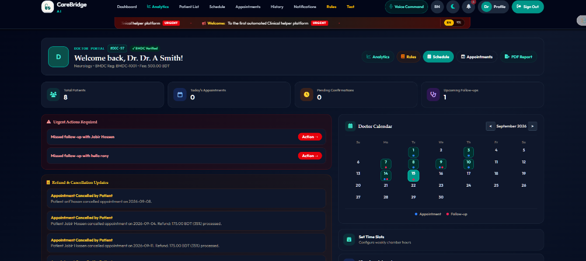
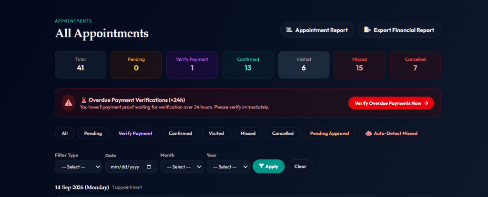
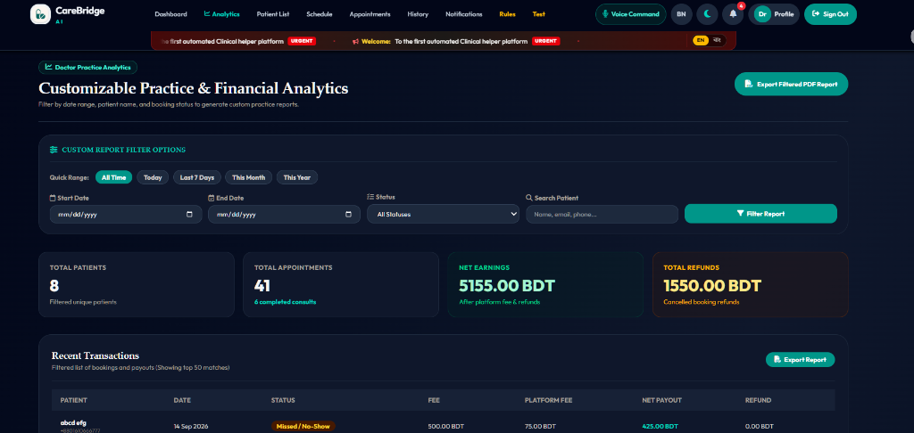
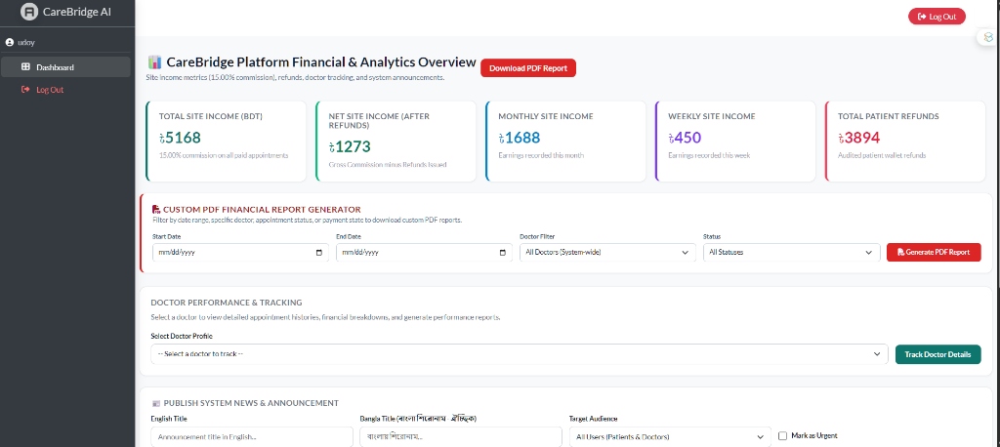
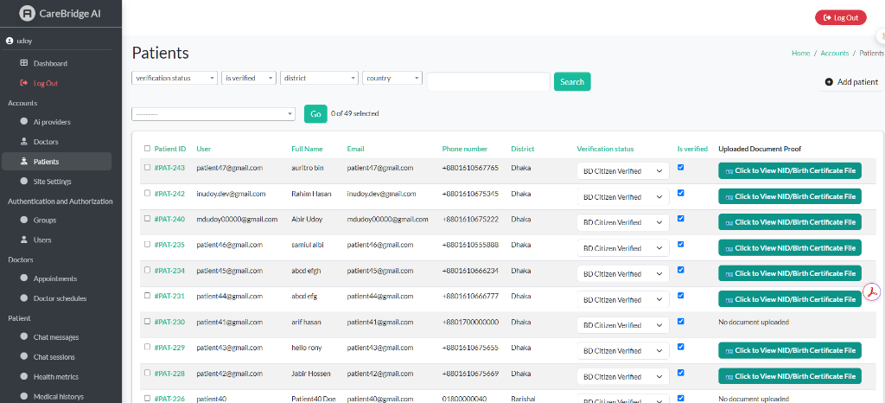
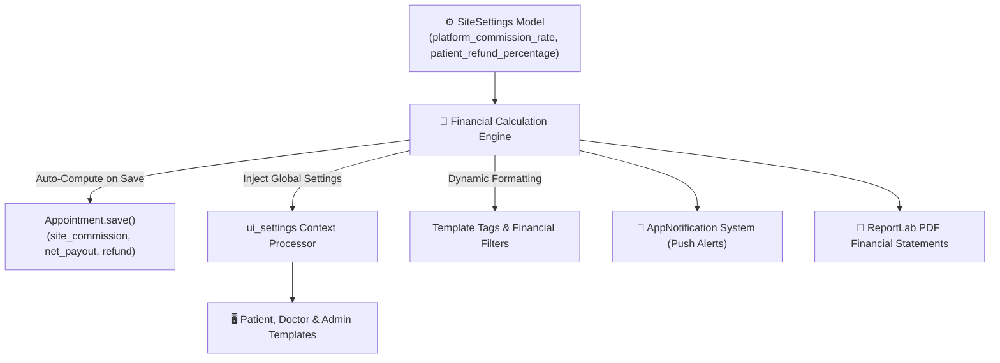
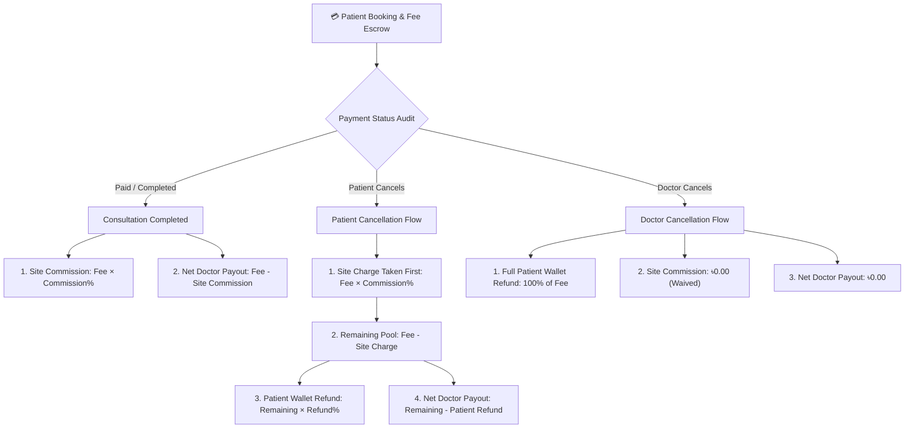
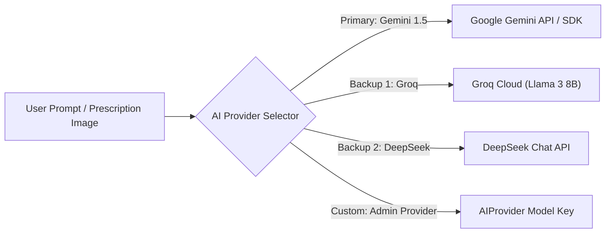

# 🏥 CareBridge AI — Smart Clinical Telemedicine & AI Health Assistant Platform

<div align="center">

[](https://www.python.org/)
[](https://www.djangoproject.com/)
[](https://tailwindcss.com/)
[](https://ai.google.dev/)
[](https://www.postgresql.org/)
[]()

**An enterprise-grade, full-stack clinical telemedicine platform equipped with multi-model AI health assistance, smart prescription generation, real-time dosage adherence tracking, role-based financial audit engines, and government identity verification.**

[Explore Portals](#-portal-architecture--system-showcase) • [System Flow](#-financial--cancellation-flow-diagram) • [Quick Start](#-installation--local-setup) • [API & AI](#-multi-model-ai-engine) • [URL Sitemap](#-key-url-sitemap)

</div>

---

## 📑 Table of Contents
- [Overview](#-overview)
- [Portal Architecture & System Showcase](#-portal-architecture--system-showcase)
  - [1. Doctor Portal & Real-time Practice Dashboard](#1-doctor-portal--real-time-practice-dashboard)
  - [2. Clinical Appointment & Overdue Payment Management](#2-clinical-appointment--overdue-payment-management)
  - [3. Doctor Financial & Practice Analytics](#3-doctor-financial--practice-analytics)
  - [4. Platform Financial Overview & Administrative Analytics](#4-platform-financial-overview--administrative-analytics)
  - [5. Citizen Patient Verification & Identity Audit](#5-citizen-patient-verification--identity-audit)
- [System Architecture & Single Source of Truth](#-system-architecture--single-source-of-truth)
- [Financial & Cancellation Flow Diagram](#-financial--cancellation-flow-diagram)
- [Core Feature Matrix](#-core-feature-matrix)
- [Multi-Model AI Engine](#-multi-model-ai-engine)
- [Technology Stack](#-technology-stack)
- [Installation & Local Setup](#-installation--local-setup)
- [Database Configuration & Migration](#-database-configuration--migration)
- [Key URL Sitemap](#-key-url-sitemap)
- [Security & Compliance](#-security--compliance)
- [License & Authors](#-license--authors)

---

## 🌟 Overview

**CareBridge AI** bridges the gap between verified clinical practitioners and patients through an automated, intelligent ecosystem. Rather than serving as just a scheduling tool, CareBridge AI provides an end-to-end clinical workflow:
- **Digital Consultations**: Automated chamber hours, slot calculation, payment escrow, and dynamic receipt generation.
- **Official Digital Prescriptions**: Instant PDF generation with cryptographic verification hashes, BMDC license validation, and doctor digital signature stamps.
- **Patient Dose Adherence**: Interactive medication track checklists with progress monitoring and automated alerts.
- **Multilingual AI Health Assistant**: Powered by **Google Gemini**, **Groq (Llama 3)**, and **DeepSeek**, offering real-time medical translation, medicine info, and health record Q&A.
- **Audited Financial Engine**: Automated site commissions, partial patient refund calculators, doctor net payouts, and downloadable financial statements.

---

## 📸 Portal Architecture & System Showcase

### 1. Doctor Portal & Real-time Practice Dashboard
A dedicated command center featuring an interactive booking calendar, daily consultation count, urgency alerts, missed follow-up tracking, and quick access to chamber schedule settings.



* **Real-time Metrics**: Today's active appointments, pending approvals, and upcoming follow-ups at a glance.
* **Interactive Appointment Calendar**: Monthly visual calendar with color-coded appointment and follow-up markers.
* **Urgent Action Center**: Immediate alert banners for missed patient consultations and automated cancellation updates.

---

### 2. Clinical Appointment & Overdue Payment Management
Full appointment lifecycle management equipped with tabbed statuses, search filters, and an overdue payment audit banner.



* **Comprehensive Status Tracking**: Filter appointments across `Pending`, `Verify Payment`, `Confirmed`, `Visited`, `Missed`, and `Cancelled`.
* **24-Hour Overdue Payment Detector**: Flags unverified transaction proofs waiting over 24 hours with one-click direct verification.
* **Automated Missed Visit Detector**: Automatically marks unattended appointments to maintain audit accuracy.

---

### 3. Doctor Financial & Practice Analytics
Granular revenue insights, customizable date filters, transaction breakdowns, and downloadable PDF statements.



* **Performance Summaries**: Net practitioner earnings after site platform charges and processed patient refunds.
* **Time Range Filtering**: Instant toggling between `All Time`, `Today`, `Last 7 Days`, `This Month`, and `This Year`.
* **Exportable Reports**: One-click generation of branded, tamper-evident practice PDF financial statements.

---

### 4. Platform Financial Overview & Administrative Analytics
Executive financial control panel for system administrators to oversee platform liquidity, commission collection, doctor performance, and emergency broadcasts.



* **Automated Commission Accounting**: Tracks total platform gross revenue (15% standard commission) and net platform income post-refund deductions.
* **Custom PDF Report Generator**: Date range and doctor-specific statement generation for financial reconciliations.
* **Doctor Performance Tracking**: Individual practitioner revenue volume and cancellation rate monitoring.
* **Bilingual News & Broadcasts**: Publish system-wide announcements in English and Bengali directly to portal headers.

---

### 5. Citizen Patient Verification & Identity Audit
National compliance and patient identification management system.



* **Government Document Audit**: Inspection of uploaded National ID (NID) and Birth Registration certificates before granting verified citizen status.
* **Batch Verification Actions**: Filter by verification state, district, or user credentials with one-click confirmation.

---

## 📐 System Architecture & Single Source of Truth

CareBridge AI utilizes a centralized `SiteSettings` configuration engine (`accounts/models.py`) to govern all platform financial calculations, site rules, UI badges, notification messages, and PDF statements dynamically.



### 🔹 Single-Source-of-Truth Variables:
* `platform_commission_rate`: Configurable platform site charge percentage (Default: `15.00%`).
* `patient_refund_percentage`: Configurable partial refund percentage on patient-initiated cancellations (Default: `35.00%`).

> Changing any rate in `SiteSettings` automatically propagates across all financial math, notification texts, user templates, and PDF reports instantly without code modification.

---

## 🔄 Financial & Cancellation Flow Diagram

CareBridge AI enforces strict, audit-compliant financial accounting for all transactions:



---

## 🌟 Core Feature Matrix

| Feature Domain | Capabilities |
| :--- | :--- |
| **Patient Portal** | • Unique `#PAT-ID` identity tracking<br>• Real-time Daily Dose Tracker (Morning / Afternoon / Evening / Night)<br>• Verified Doctor directory with slot picker<br>• Multilingual AI Medical Assistant<br>• Automated cancellation & wallet refund manager<br>• Overall Medical Summary ReportLab PDF |
| **Doctor Portal** | • BMDC credential validation badge (`#DOC-ID`)<br>• Interactive weekly schedule & fee configurator<br>• Digital Prescription Builder with dosage instructions<br>• Cryptographic Prescription Hash & Virtual Signature Card<br>• Follow-up scheduling with automatic patient alerts<br>• Financial statement PDF exporter |
| **Admin & Compliance** | • Role-Based Access Control (RBAC) middleware<br>• Government ID (NID/Birth Certificate) review portal<br>• Site-wide dynamic commission & refund controls<br>• Doctor performance tracking & safe deletion safeguard<br>• Bilingual system announcement broadcast manager |
| **AI Intelligence** | • Multilingual voice and text consultations (English & Bangla)<br>• Prescription OCR & translation engine<br>• Automated health metric history and vitals trend analyzer<br>• Multi-provider fallback support (Gemini, Groq, DeepSeek, OpenAI) |

---

## 🤖 Multi-Model AI Engine

The platform features an intelligent fallback architecture:



* **Prescription Translation**: Translates doctor prescriptions into plain, patient-friendly language in both English and Bangla.
* **Dosage Explanations**: Details frequency, food precautions, and potential side-effects.
* **Symptom Clarification**: Initial triage guidance advising when immediate in-person emergency care is required.

---

## 🛠️ Technology Stack

| Layer | Technologies |
| :--- | :--- |
| **Backend** | Python 3.10+, Django 4.2+ |
| **Frontend** | Tailwind CSS, Vanilla JavaScript, FontAwesome 6 Pro |
| **Database** | PostgreSQL / SQLite3 |
| **AI & LLM** | Google Generative AI (Gemini), Groq API, DeepSeek |
| **Document Generation** | ReportLab PDF Engine (with TTF Unicode Font Registration) |
| **Middleware** | `RoleBasedAccessMiddleware`, `NoCacheAuthenticationMiddleware` |

---

## 🚀 Installation & Local Setup

### 1. Prerequisites
* Python 3.10 or higher
* Git
* Virtualenv

### 2. Clone and Setup Environment
```bash
# Clone the repository
git clone https://github.com/udoydev/CareBride_AI.git
cd "Carebridge AI"

# Create a virtual environment
python -m venv env

# Activate the virtual environment
# Windows (PowerShell):
.\env\Scripts\Activate.ps1
# Linux / macOS:
source env/bin/activate
```

### 3. Install Dependencies
```bash
pip install -r requirements.txt
```

### 4. Configure Environment (`.env`)
Create a `.env` file in the project root based on `.env.example`:
```env
# AI Model Configuration
AI_PROVIDER=gemini
GEMINI_API_KEY=your_gemini_api_key_here
GROQ_API_KEY=your_groq_api_key_here

# Database Configuration (Defaults to SQLite if omitted)
DB_ENGINE=sqlite
```

### 5. Run Migrations & Start Server
```bash
# Apply migrations
python manage.py migrate

# Create administrator account
python manage.py createsuperuser

# Launch development server
python manage.py runserver
```

Open `http://127.0.0.1:8000` in your web browser.

---

## 🗄️ Database Configuration & Migration

CareBridge AI supports seamless switching between **SQLite** (lightweight local development) and **PostgreSQL** (production deployment):

### Switching to PostgreSQL:
1. Update your `.env`:
   ```env
   DB_ENGINE=postgresql
   DB_NAME=carebridge_db
   DB_USER=postgres
   DB_PASSWORD=your_password
   DB_HOST=localhost
   DB_PORT=5432
   ```
2. Run database migrations:
   ```bash
   python manage.py migrate
   ```

---

## 🗺️ Key URL Sitemap

### 🔑 Authentication & Accounts
* `/login/` — Multi-role authentication (Patient, Doctor, Administrator)
* `/register/` — Multi-step registration wizard
* `/profile/` — Account settings & profile management
* `/logout/` — Secure session invalidation

### 🩺 Patient Portal
* `/patient/dashboard/` — Daily patient overview & vitals
* `/patient/doses/today/` — Real-time medication checklist
* `/patient/doctors/` — Verified doctor directory & schedule booking
* `/patient/chat-ui/` — Multilingual AI Health Assistant
* `/patient/overall-report/` — Overall Medical Summary PDF report

### 👨‍⚕️ Doctor Portal
* `/doctors/dashboard/` — Doctor command center & calendar
* `/doctors/appointments/` — Appointment management & payment verification
* `/doctors/schedule/` — Weekly chamber slot configuration
* `/doctors/patient/<id>/` — Patient health history & prescription archive
* `/doctors/prescriptions/<id>/download/` — Branded prescription PDF with digital signature

### 🛡️ Administration
* `/admin/` — Django admin control panel
* `/reports/admin/doctors/tracking/` — Doctor practice financial tracking
* `/reports/admin/financial-report/` — Custom PDF platform financial statement generator

---

## 🔒 Security & Compliance

* **Role-Based Access Control (RBAC)**: Custom Django middleware strictly segregates URL routes between patients, doctors, and system administrators.
* **Tamper-Evident Prescriptions**: Every prescription includes a unique cryptographic verification hash `#CARE-RX-[ID]-[TIMESTAMP]`.
* **Secure Payment Proofs**: Encrypted media handling for citizen national ID uploads and mobile payment slips.
* **No-Cache Authentication**: Browser caching disabled on sensitive clinical dashboards to protect patient privacy on shared workstations.

---

## 📄 License & Authors

Developed by **Abir Hasan Udoy** as part of the **CareBridge AI** Telemedicine Network.
*All rights reserved. Proprietary software.*